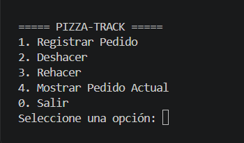
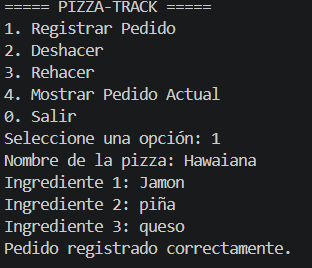
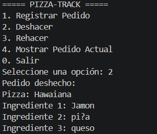
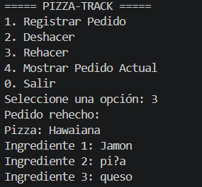
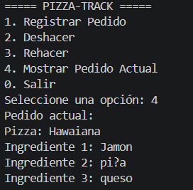

# S35 - Manipulación de Arreglos y Listas en Java

Autor: Alejandro García

## EA2 - Actividad: Pilas (Stack)

### Pizza-Track

Simulador de gestión de pedidos de pizza desarrollado en Java utilizando dos pilas implementadas manualmente mediante nodos enlazados.

El proyecto permite registrar pedidos, deshacer el último pedido realizado, rehacer un pedido deshecho y consultar el pedido actual.

## Objetivo

Comprender el funcionamiento de una estructura de datos tipo pila (Stack) y aplicar sus operaciones principales:

- push()
- pop()
- peek()
- isEmpty()

## Funcionamiento

El sistema utiliza dos pilas implementadas mediante nodos enlazados:

### Pila Principal
Almacena los pedidos activos.

### Pila Secundaria
Almacena temporalmente los pedidos que han sido deshechos, permitiendo realizar la operación de rehacer.

## Opciones del sistema

1. Registrar Pedido: permite ingresar el nombre de una pizza y tres ingredientes.
2. Deshacer: retira el último pedido de la pila principal y lo pasa a la pila secundaria.
3. Rehacer: recupera el último pedido deshecho y lo devuelve a la pila principal.
4. Mostrar Pedido Actual: consulta el pedido que se encuentra en el tope de la pila sin eliminarlo.
5. Salir: finaliza el programa.

## Estructura del proyecto

`text
Garcia_Alejandro_EA2_Pilas/
│
├── src/
│   ├── Main.java
│   ├── Pizza.java
│   ├── Nodo.java
│   ├── Pila.java
│   └── GestionPedidos.java
│
└── README.md

## Requisitos

- Java JDK instalado.
- Visual Studio Code.
- Extensión de Java para Visual Studio Code.

## Ejecución

1. Abrir el proyecto Garcia_Alejandro_EA2_Pilas en Visual Studio Code.
2. Abrir la carpeta src.
3. Ejecutar el archivo Main.java.
4. Seleccionar una opción del menú.
5. Seguir las instrucciones mostradas en la consola.

## Ejemplo de uso

El flujo principal del sistema puede realizarse de la siguiente manera:

`text
1. Registrar Pedido
2. Deshacer
3. Rehacer
4. Mostrar Pedido Actual
0. Salir

## Evidencias

### Menú principal

Aquí se muestra el menú principal de Pizza-Track.

### Registro de pedido

Aquí se muestra el registro de una pizza con sus tres ingredientes.

### Deshacer

Aquí se evidencia cómo el último pedido pasa de la pila principal a la pila secundaria.

### Rehacer

Aquí se evidencia cómo el pedido deshecho vuelve a la pila principal.

### Mostrar pedido actual

Aquí se muestra el pedido ubicado en el tope de la pila mediante peek().

## Estructuras utilizadas

### Clase Pizza

Representa cada pedido y almacena el nombre de la pizza junto con sus tres ingredientes.

### Clase Nodo

Representa cada nodo de la lista enlazada y contiene una pizza y la referencia al siguiente nodo.

### Clase Pila

Implementa la estructura de pila mediante nodos enlazados y contiene las operaciones:

- push()
- pop()
- peek()
- isEmpty()

### Clase GestionPedidos

Controla la Pila Principal y la Pila Secundaria para implementar las funciones de registrar, deshacer y rehacer pedidos.
